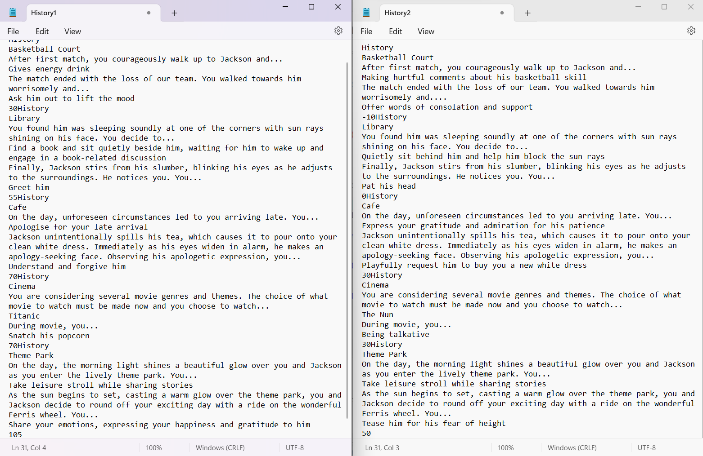

# CPT113_Group42_Hackathon2
# Hackathon2
## 1. Project Description:
   
"Unexpected Encounters" is an interactive multiplayer game about relationships and making decisions. Two players are involved in various settings in which they encounter the main character, Jackson.

In the game, players can select from options (Option A, B or C), each with a score that influences their relationship with Jackson. Players actively create the storyline by navigating their character's journey and changing their relationship with Jackson. Players are encouraged to invest their emotions and thoughts in the game.

Embark on this exciting journey to discover a multitude of chapters and scenes set in various locations. From the bustling basketball court to the serene library, the cosy cafe to the enchanting cinema, and the thrilling theme park, each unique setting offers a new and engaging experience. 

Immerse yourself in the interactive storyline, where your decisions throughout the game will turn into multiple possible outcomes. Every decision shapes the narrative and influences your character's relationships and ultimate destiny. This dynamic and branching storyline ensures high replay value, inviting you to explore different paths and uncover different results of the game.

## 2. Project Features:
- Multiple Player Game
   - A two-player game in which each player independently makes decisions.

- Saving and loading history capabilities
   - Choose options ('Y' or 'y') to continue the game or ('N' or 'n') to quit the game after each chapter. If the player chooses to quit the game, they can save their game progress and resume where they left off later for convenience and continuity. The game progress is stored in two files for each player. Every time the game starts, the two files that store players' data will be read by the program; if there is data inside the file, the data (places and actions players choose) will print out, and players can continue to the chapters or places they haven't explored, otherwise if there is no data inside, players will start the game from the beginning.

- Diverse Chapters and Scenes Set in Several Locations
   - Explore a series of diverse chapters and scenes set in several locations. Play the game's interactive storyline as you delve into settings like a basketball court, library, cafe, cinema, and theme park. Each location has different scenes and options for players to shape their relationship with our main character and influence the outcome of the game.

- Multiple Choice for Establishing relationships
   - Choose options (A, B, or C) that correspond to your character's behaviours, thoughts, and emotions when making decisions at crucial times.
   - The selected action options able players to engage with Jackson in order to forge bonds and shape the dynamics of the interactions in the game.

- Friendly User Interface
   - Instructions are clearly written.
   - Utilise an easy-to-use user interface to move through scenes, read descriptions, and make decisions.
     
- Scability of Game 
   - The programmer can add or remove chapters without affecting the general structure of the game by managing scenes with the linked list. This is because the game can efficiently handle more chapters by their preferred locations and scenes. This enables scalability.

## 3. Project Specification:

### 1. Input  
- From User:
   - Players choose options (Options 'A', 'B', or 'C') in each scene of the game.
   - Players choose to continue ('Y' or 'y') or quit ('N' or 'n') the game after each chapter.
- From File:
   - Previously saved game data information which are the players’ options (Options A, B, or C) for each scene
   - Previously saved game data information which are the completed chapters for continuity.

### 2. Process
- Calculate accumulated marks based on the players' options in each scene.
- Compare the total marks of the players to determine the strength of their relationship with the main character.
- Determine whether players have a stronger, weaker, or the same strength of relationship bond with the main character.

### 3.Output
- Display the accumulated marks for each player after each chapter ends.
- Display the total accumulated marks at the end of the game.
- Display whether players have a stronger, weaker, or the same strength of relationship bond with the main character.

### 4.Constraints
- Input validation where players can only choose options('A', 'B', or 'C') in each scene.
- Input validation where players can only choose to continue ('Y' or 'y') or quit ('N' or 'n') after each chapter.

### 5. Assumptions
- The game consists of 5 places or chapters, with each chapter having 2 scenes.
- Each scene with only 3 options ('A', 'B', or 'C') 
- Each option has a different scoring, which can be positive or negative.
- The total score for each player is the sum of their scores after each chapter, considering the choices made in each scene.

### 6. Formula
- Total score of player 1 = Total score of player 1 + Score obtained of player 1 in each scene.
- Total score of player 2 = Total score of player 2 + Score obtained of player 2 in each scene.

## 4. Object-oriented Concept:
In the game, there are 9 classes that utilize object-oriented concepts:

1. FileInclusion (Composition class of Place): This class is responsible for reading two files that store historical data. It returns the number of places that the players have visited.

2. Place: This class sets the place name, scene1, scene2, action1, and action2 based on the values passed from the classes BasketballCourt, Library, Cafe, Cinema, and ThemePark.It passes these values to the HistoryList class to append a node to the linked list.The calculation of total marks for player 1 and player 2 are performed in this class as well.

3. PlaceList (Inherited from class HistoryList and class Place): This class is derived from both the HistoryList and Place classes. It is used to link a place to next place together when players want to continue the game, maintaining the order of places visited.

4. HistoryList: This class implements a linked list data structure. It allows for appending a list node when players visit a new place, dynamically growing the list. It also writes the data stored in the linked list into the players' history file.

5. BasketballCourt (Composition of class Place): This class represents the basketball court location which is also Chapter 1 in the game. It prints out the setting and scenes in the basketball court and get the players' actions.

6. Library (Composition of class Place): This class represents the library location which is also Chapter 2 in the game. It prints out the setting and scenes in the library and get the players' actions.

7. Cafe (Composition of class Place): This class represents the cafe location which is also Chapter 3 in the game. It prints out the setting and scenes in the cafe and get the players' actions.

8. Cinema (Composition of Place): This class represents the cinema location which is also Chapter 4 in the game. It prints out the setting and scenes in the cinema and get the players' actions.

9. ThemePark (Composition of class Place): This class represents the theme park location which is also Chapter 5 in the game. It prints out the setting and scenes in the theme park and captures the players' actions.

These classes utilize concepts such as **composition**, **inheritance**, and **encapsulation** to organize and manage the game's functionality and data effectively.

## 5. Data structures(Linked-list):

In our game, we employ a **linked list** data structure through the implementation of a dynamic linked list in the "HistoryList" class. This implementation allows the linked list to expand and shrink during program execution. Each node in the linked list consists of five string data elements: placeName, scene1, scene2, action1, and action2. Additionally, each node contains a pointer to the next node in the list. The class includes a default constructor that initializes the head of the linked list.

To manipulate the linked list, there are four member functions available:

- 'appendListNode1': This function appends a new node to the end of the linked list specifically for player 1.

- 'appendListNode2': Similarly, this function appends a new node to the end of the linked list specifically for player 2.

- 'writeListNode1': This function opens the file that stores historical data for player 1 and writes the contents of the linked list into the file.

- 'writeListNode2': Likewise, this function opens the file that stores historical data for player 2 and writes the contents of the linked list into the file.

These member functions allow for the dynamic management of the linked list, enabling the addition of new nodes for each player and the ability to write the linked list's contents to respective files for historical data storage.

## 6. How the Game Play & Screenshot
1. Screenshot 1
- First time user.
- The absence of a history file is indicated by the message "The file is not open properly."
- The instructions to play this game is clearly displayed.
     

2. Screenshot 2
- After pressing the enter key, the story of Chapter 1 was unveiled.
     

3. Screenshot 3
- Each chapter consists of two scenes.
- Two player take turn to choose their preferred actions.
- They have three options to choose from for each scene.
     

4. Screenshot 4
- To exit the game, players input 'N' when prompted with the question "Do you want to proceed to the next place? (Y/N)"
- The score of each player is computed and displayed on the terminal, taking into account their chosen options.
- The program terminates after displaying the scores.
     

5. Screenshot 5
- The storyline and scores for each player is saved in separate text files: "History1.txt" for player 1 and "History2.txt" for player 2.
     

6. Screenshot 6
- The players proceed with the game.
- The program reads the contents of the "History1.txt" and "History2.txt" files.
- The terminal displays the previous saved game progress, starting with player 1 and followed by player 2.
     

7. Screenshot 7
- Proceed to Chapter 2.
- Implement input validation where players are required to reenter their option if it is not within the allowed choices of (A, B, or C).
     

8. Screenshot 8
- Players choose to continue the game by entering 'Y' when prompted with the question "Do you want to proceed to the next place? (Y/N)"
- The score of each player is calculated and displayed on the terminal, taking into account their chosen options.
- The program continues execution to next chapter without interruption.
     

9. Screenshot 9
- Implement input validation where players are required to reenter their option if it is not within the allowed choices of ('Y' or 'y') to continue the game, or ('N' or 'n') to quit the game.

10. Screenshot 10
- The game concludes with a comparison between the relationships of the two players with the main character, Jackson.
- The storyline and scores for each player is saved in separate text files: "History1.txt" for player 1 and "History2.txt" for player 2.
- Following this comparison, the program exits.
    

11. Screenshot 11
- The separate text files, "History1.txt" for player 1 and "History2.txt" for player 2, store the entire progress of the game.
    

